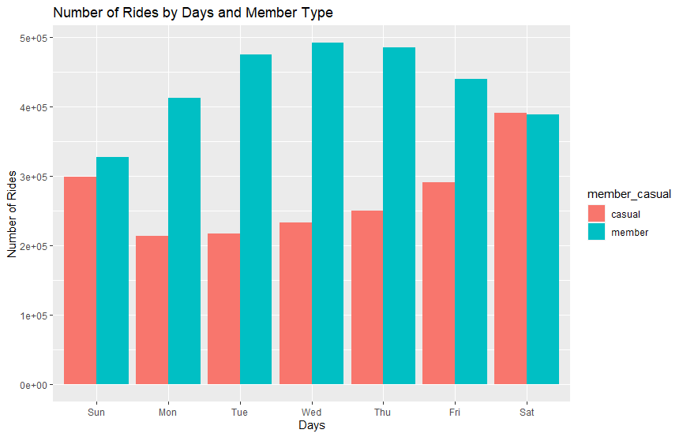
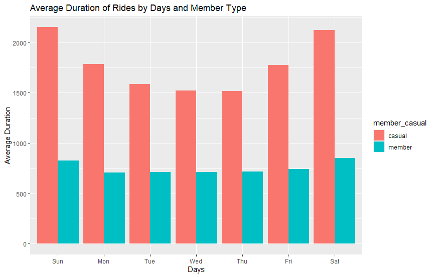
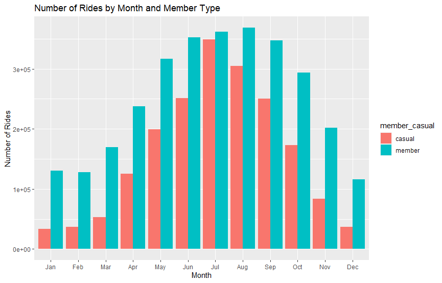
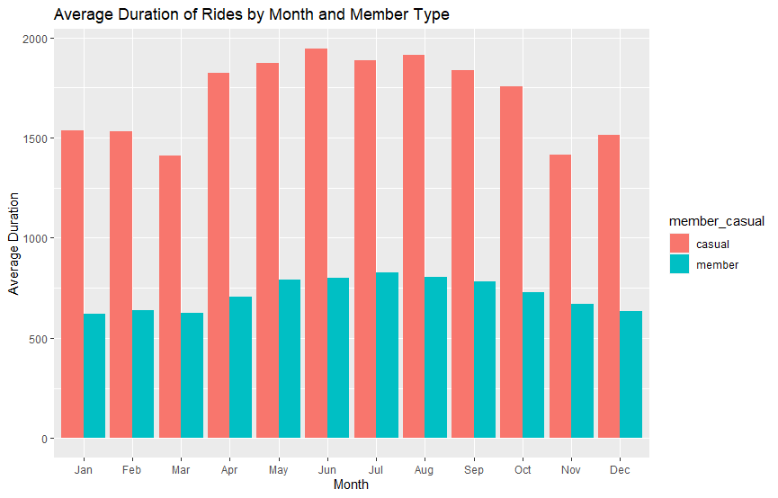
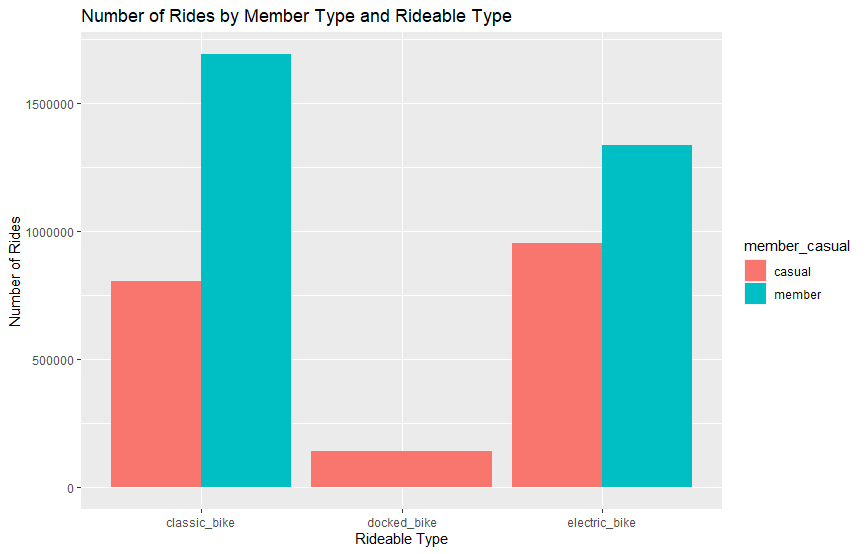
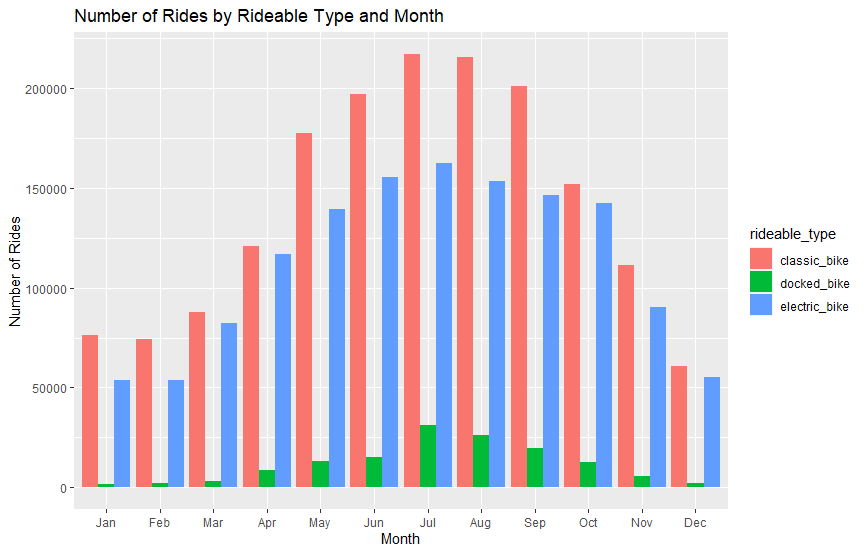

Google data analytics capstone project cyclistic bike-share analysis by Mert Can Cankaya.

## Background
This is the Capstone project of the Google Data Analytics Professional Program on Coursera.

In the hypothetical scenario of the case study, I am a junior data analyst working in the marketing department of the fictional Chicago-based bike-sharing company Cyclistic. In 2016, Cyclistic launched a successful bike-share offering that has grown to a fleet of 5,824 bicycles that are tracked and locked into a network of 692 stations across Chicago. The company is looking to shift from broad marketing focused on general brand recognition to a more concentrated campaign to convert casual riders into members — those paying for annual subscriptions, as opposed to one-day passes or single rides. The transition in strategy is based on an analysis by the financial department which concluded that annual members are more profitable than casual riders.

The director of marketing and my manager Lily Moreno has tasked me personally with doing an analysis of the differences in the use of the service between casual and annual members. Its insights and recommendations will then be used to design an effective advertising campaign.

In this project, I will look at members and casual riders in their differences across 6 dimensions:

•	Number of rides by month

•	Average duration of rides by month

•	Number of rides by days

•	Average duration of rides by days

•	Number of rides by rideable type

•	Number of rides by rideable type by month

The dataset which includes data from the last 12 months between July 2022 to June 2023 (link of the dataset), has 5,779,444 rows and 13 columns.  Because it's a large dataset, I decided to use R Studio which is better at dealing with large datasets instead of using Excel or SQL. I use R for cleaning, analyzing, and visualizing the data. Then I use visuals to prepare a presentation with PowerPoint. You can see the presentation with this [link](cyclistic-presentation.pptx).

# Ask
Business Question:

How do annual members and casual riders use Cyclistic bikes differently?

Key Stakeholders:

•	The director of marketing and manager Lily Moreno

•	Cyclistic marketing analytics team

•	Cyclistic executive team

Business Task:

Use the data to explore and gain insights into how annual members and casual riders use bikes differently. From trends and insights, assist the team to implement marketing strategies aimed at converting casual riders into annual members.

# Prepare

All of the functions in this preparation stage are done in R Studio. You can find the code of all processes in [cyclistic](cyclistic.r) document.

I downloaded the last 12 months between July 2022 to June 2023 (link to the dataset).

#Combine All 12 Documents into a Single Document and Import as Dataset

#Result of Combining All Data

Rows: 5,779,444

Columns: 13

# Process

All of the functions in this process stage are done in R Studio. You can find the code of all processes in [cyclistic](cyclistic.r) document.

#Inspect the new table that has been created

#List of column names

#How many rows are in data frame?

#Dimensions of the data frame?

#See the first 6 rows of data frame.  Also tail( df)

#See list of columns and data types (numeric, character, etc)

#Statistical summary of data. Mainly for numerics

#Reassign to the desired values

#Check to make sure the proper number of observations were reassigned

#Add columns that list the date, month, day, and year of each ride

#This will allow us to aggregate ride data for each month, day, or year ... before completing these operations we could only aggregate at the ride level

#Add a "ride_length" calculation to  df (in seconds)

#Convert "ride_length" from Factor to numeric so we can run calculations on the data

#Remove "bad" data

#The dataframe includes a few hundred entries when bikes were taken out of docks and checked for quality by Divvy or ride_length was negative
#We will create a new version of the dataframe (2) since data is being removed

#Remove NA Values

# Analyze

All of the functions in this analyze stage, are done in R Studio. You can find the code of all processes in [cyclistic](cyclistic.r) document.

#Descriptive analysis on ride_length (all figures in seconds)

mean(df2$ride_length,na.rm = TRUE) 

#Summary

#Compare members and casual users

#The days of the week are out of order

#See the average ride time by each day for members vs casual users

#analyze ridership data by type and weekday

# Share

All of the functions in this share stage, are done in R Studio. You can find the code of all processes in [cyclistic](cyclistic.r) document.

#Let's visualize by Number of Rides by Days and Member Type

 
#### Analysis: We can see members are using bikes more on weekdays for commuting between home and work or school. But casuals are more active on weekends because they are using the bikes for recreational activities.

#Let's create a visualization for the average duration of rides by days and member type
  
  
 
#### Analysis: While casual users are using bikes for longer durations and durations increase in weekends, members use for smaller distances with a slight increase in weekends.

#Let's create a visualization for the Number of Rides by Month and Member Type

 

#### Analysis: Both members and casuals use bikes way more in warmer months. Summer is most active season. In every month, members have a higher number of rides. The difference between causals and members increases in winter while it decreases in summer.

#Let's visualize by Average Duration of Rides by Month and Member Type

 
 
#### Analysis: Causal rides always have a longer average duration of rides compared to members. 

#Let's visualize by Number of Rides by Member Type and Rideable Type

 
 
#### Analysis: The most chosen bike type by members is the classic bike while causals prefer electric over classic bikes. Docked bikes least favorite bike type for both groups. Members never use docked bikes.

#Let's visualize by Number of Rides by Rideable Type and Month

 
 
#### Analysis: Classic bikes are overall the most used bikes every month followed by electric bikes. Docked bikes have significantly less number of rides compared to the other bike types.

### The main distinctions between Members and Casual Riders are listed as follows:
#### Members:

•	Members typically ride bicycles to get to work, school, and other destinations every day.

•	Peak months are from May to September, coinciding with good weather for biking. 

•	Average trip length is shorter and steady, reflecting routine commuting to familiar areas.

#### Casual Riders:

•	Casual riders use bikes for leisure and entertainment purposes.

•	Casual riders have longer average ride lengths, using bikes for strolling and exploration.

•	Peak months align with the warmer months of the year.

•	Peak activity happens during weekends.

#### Comparison of Casual Riders and Members:

•	Casual riders use bikes for leisure, while members use them for daily commuting.

•	Average ride length varies, shorter and consistent for members, longer and more exploratory for casual riders.

•	Peak months align with the weather for both groups, but peak days differ - weekdays for members and weekends for casual riders.

# Act
### Conclusion
In conclusion, the analysis of the information provided reveals distinct patterns and preferences between members and casual riders when it comes to bicycle usage. Members predominantly utilize bicycles as a means of daily commuting, relying on them to travel to work, school, and other destinations throughout the year. The average trip length for members remains relatively steady, indicating routine commuting to familiar areas, regardless of the season.

On the other hand, casual riders employ bicycles primarily for leisure and entertainment purposes. Their rides tend to be more exploratory and longer in distance, allowing them to indulge in strolling and exploring various locations during the warmer months from May to September. Moreover, the peak activity for casual riders predominantly occurs on weekends, aligning with their desire for leisurely biking during their free time.

While both groups experience peak months during the warmer seasons, there is a clear distinction in peak days. Members witness heightened activity on weekdays when they use bicycles for their daily commutes, while casual riders enjoy their peak moments over weekends when they seek recreational biking experiences.

Overall, these findings shed light on the different roles bicycles play in the lives of members and casual riders. Understanding these variations in behavior and preferences can be valuable for stakeholders and marketing team to make better business decisions in the future.

### Recommendations
•	Due to the high popularity of bike usage throughout the summer and early fall, it would be a good idea to launch an incentive campaign to maintain or increase bike usage

•	Casual riders spend more time riding bikes, therefore providing some kind of discounts or promotions for the electric bike would help them save some time

•	Launch a marketing campaign that targets the benefits of converting into annual membership for casual riders through advertisements, emails, and brochures

•	 Summer Membership: Offer a seasonal membership for summer (May to August) tailored for casual riders, emphasizing bikes near popular attractions and entertainment spots.

•	Weekend Discounts: Provide exclusive discounts for weekends and longer rides to incentivize casual riders to become members and enjoy cost savings.

•	The company should not invest more in docked bikes because its least used by both members and causals by a large margin. Also, the company might think of completely removing docked bikes and changing them with more used classic or electric bikes.

Implementing these concise methods can help the marketing campaign turn casual bikers into valued members, enhancing their summer bicycling experience. By doing so, the company can be more profitable in the future.

